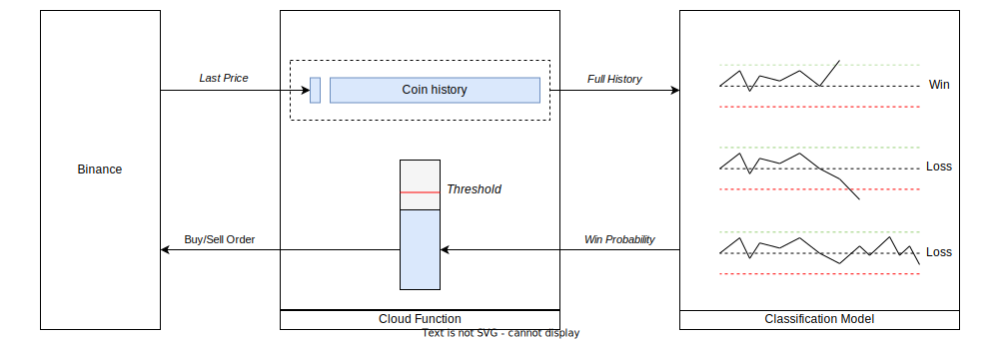
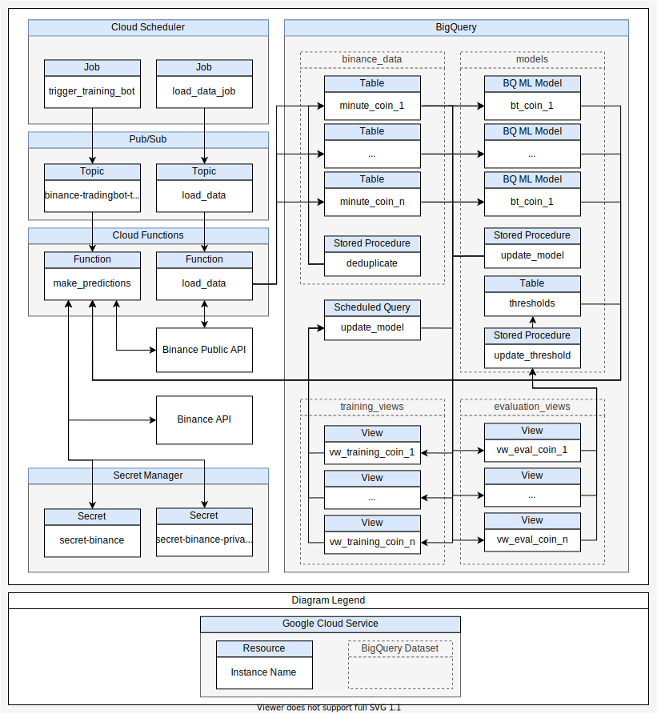
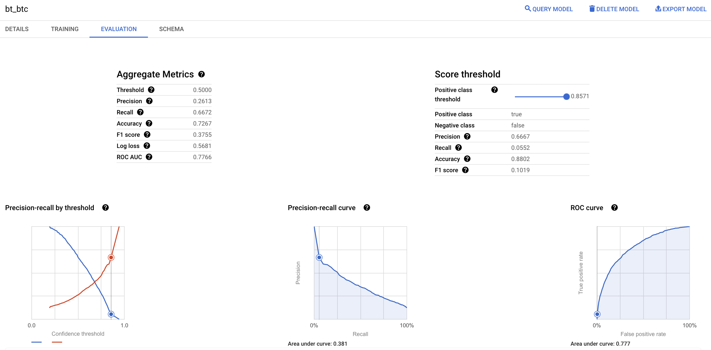

# BigQuery Binance Bot

This project aims at creating a simple crypto-currency trading bot running on [Google Cloud Platform](https://console.cloud.google.com/). It uses the [Binance API](https://binance-docs.github.io/apidocs/) to trade on the spot market, and Google Cloud's BigQuery integrated machine learning models to detect favorable opportunities. 

## Contents

- [How does it work ?](#how-does-it-work)
- [What is in this repository ?](#what-is-in-this-repository)
- [Usefull commands](#useful-commands)
- [Project Setup](#project-setup)
- [Future Improvements](#todo)

 
> _This project is just meant as an experiment of BigQuery's ML capabilities, so if you wish to use this project with your funds, make sure you understand what you are doing! There are also simpler ways to use a machine learning model on Google Cloud, if you are interested in the crypto trading itself, you could consider running the model with a different service from Google (and improving its performance 😉)._


## How does it work? 

Every minute, a Cloud Function is triggered, calling Binance's API to get the latest price information for a set of coins.
With that price and the stored prices of these coins of the preceding 1440 minutes, the function calls an ML model running in BigQuery. The model produces an estimation of the probability that each considered coin will undergo a 1% growth in the coming hour. This estimation is compared to a preset threshold to determine whether the coin should be purchased or not. If within that hour, the coin does not reach the stop loss or the take profit limits, it is sold.



Every month, the models are re-trained using the latest available data. The thresholds used for the purchase decisions are updated as well. 

## What is in this repository?

### IAC (infrastructure as code) 
The infrastructure used in this project is defined with Terraform, and contained in the **iac** folder. This code allows the automatic deployment of resources of the following Google Cloud services:
- Functions 
- BigQuery Datasets
- BigQuery Stored Procedures 
- BigQuery Scheduled Queries
- BigQuery Tables
- BigQuery Views 
- Secrets 
- Scheduler 
- PubSub

These resources are arranged as described in the following diagram :


### Tools
The tools folder contains:
- A parameter file used to define the number of coins that are to be used by the bot to make the predictions, coin.lst.
- A python script that can be used to fill the tables with Binance data 
- A script generating the terraform infrastructure for the coins listed in the parameter file


## Useful commands

The makefile at the root of this repository can be used to easily deploy the infrastructure.

To make sure that the infrastructure changes you would deploy are coherent with your expectations, you can look at Terraforms output provided by this command:

```
make plan
```

To deploy the infrastructure if you are satisfied with the plan, simply run:
```
make deploy
```

(Please see the Setup section below for the first deployment)

## Project Setup 

1. [Installation of the required tools](#1---installation-of-required-tools)
2. [Google Cloud project setup](#2---setup-of-the-google-cloud-project)
3. [Creation of the infrastructure](#3---creation-of-the-infrastructure)
4. [Training of the ML models](#4---training-of-the-ml-models)
5. [Connection to the Binance API](#5---connection-to-the-binance-api)

### 1 - Installation of required tools

If you wish to set up this bot, you need to use the folowing tools:

 - [The gcloud CLI](https://cloud.google.com/sdk/docs/install)
 - [Terrafom](https://learn.hashicorp.com/tutorials/terraform/install-cli)
 - [Tfsec](https://github.com/aquasecurity/tfsec)


### 2 - Setup of the Google Cloud Project

Create a Google Cloud project using the Google Cloud CLI
```
 gcloud projects create PROJECT_ID
```
Make sure this is now set as your default project
```
 gcloud config set project PROJECT_IT
```
Create the folowing environement variable, which will be used as an input by Terraform:
```
export TF_VAR_project=PROJECT_ID
```

[Link the project to a billing account](#https://cloud.google.com/billing/docs/how-to/modify-project) in GCP (even if the project can stay in the free tier, this is needed for some APIs below)

Enable the cloud function, cloud data transfer, scheduler, secret manager, and build APIs :
```
gcloud services enable bigquerydatatransfer.googleapis.com cloudfunctions.googleapis.com cloudscheduler.googleapis.com enable cloudbuild.googleapis.com services enable secretmanager.googleapis.com
```

### 3 - Creation of the infrastructure

List the coins you want your bot to use in the coin.lst parameter file of the tools folder, for instance: 
```
ETH
BTC
BNB
```
:warning: **Google Cloud's free Tier**: If you want to stay in  the free tier, do not use more than 3 coins (pricing of January 2022)

Initialize Terraform, and then deploy the infrastructure :
```
make init
make deploy
```

At that point, Terraform should return errors because some views being created need the ML models. However, the data must be loaded in BigQuery before these can be built, as explained in the following step.

### 4 - Training of the ML models

Use the tool script to load the Binance data in your BigQuery infrastructure :
```
cd tools
python complete_historical_data.py    
```
This step should be relatively slow, as all the coins will be loaded in BigQuery one by one, using the rate-limited Binance API. Once it's done, verify that the data is in the tables by using the [cloud console](https://console.cloud.google.com/bigquery).

You can now create models for each coin using the stored procedure to train them : 
```
bq query --nouse_legacy_sql "CALL `PROJECT_ID.models.update_model_COIN`();"
bq query --nouse_legacy_sql "CALL `PROJECT_ID.models.update_model_COIN`();"
```

After the training, you should be able to see something similar to this in the "models" dataset:


Deploy the infrastructure again in order to build the final views with Terraform.
```
make deploy
```

### 5 - Connection to the Binance API

Once the secrets' infrastructure has been created, you can [generate a Binance API key](https://www.binance.com/en/support/faq/360002502072) with your Binance Account and insert it in Google Cloud's secret manager :

```
printf "your private secret" | gcloud secrets versions add secret-binance-private 
printf "your api key"| gcloud secrets versions add secret-binance 
```

Please be careful not to leave these keys anywhere they could be used by someone. 

### 6 - Monitor your bot

That's it, now your bot is running, you should be able to see the trades in the trades table, in your Binance Order history, or in the logs of the cloud function. 

## TODO
- [ ] Implement status emails for easier monitoring
- [ ] Improve models
- [ ] Simplify backtesting
- [ ] Use Limit Orders instead of Market Orders
- [ ] Keep old models and only change to a new one if it increases the performance
